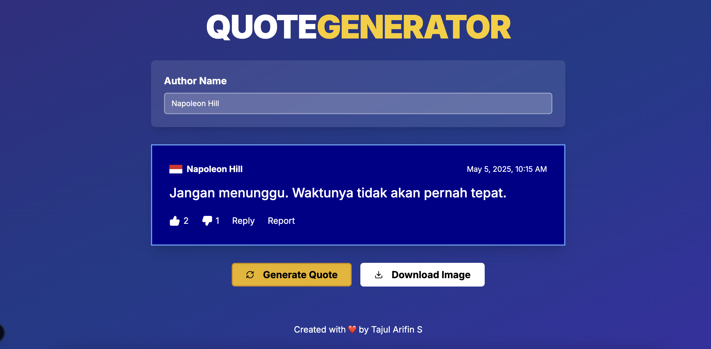

# Motivational Quote Generator

A web application that generates motivational quotes with a social media post-like appearance. Users can customize the author name and download the quotes as images.



## Features

- Generate random motivational quotes from a JSON database
- Customize the author name
- Download quotes as images
- Social media post-like appearance with likes, dislikes, reply, and report options
- Responsive design for all devices

## Quotes Database

All motivational quotes are stored in a JSON file located at `data/quotes.json`. This makes it easy to:

- Add new quotes
- Modify existing quotes
- Translate quotes to different languages

The structure of the quotes JSON file is as follows:

```json
{
  "quotes": [
    {
      "text": "Quote text goes here",
      "author": "Author Name"
    }
    // more quotes...
  ]
}
```

## Installation

Follow these steps to set up the project locally:

```bash
# Clone the repository
git clone https://github.com/arifintajul4/x-motivation.git

# Navigate to the project directory
cd x-motivation

# Install dependencies
npm install
# or
yarn install
# or
pnpm install

# Start the development server
npm run dev
# or
yarn dev
# or
pnpm dev
```
